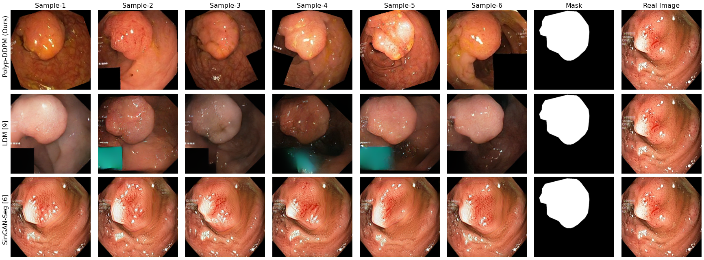

<!-- #region -->
# Polyp-DDPM: Diffusion-Based Semantic Polyp Synthesis for Enhanced Segmentation



## Overview

Welcome to the official PyTorch implementation of "Polyp-DDPM: Diffusion-Based Semantic Polyp Synthesis for Enhanced Segmentation". Polyp-DDPM is a novel diffusion-based method designed to generate gastrointestinal (GI) tract polyp images from segmentation masks. This method aims to improve polyp segmentation by tackling the significant challenges of data limitations, high annotation costs, and privacy concerns prevalent in medical imaging. Leveraging advanced diffusion models conditioned on segmentation masks, Polyp-DDPM surpasses existing methods in image quality and segmentation performance.

## Getting Started

### Prerequisites

- Python 3.8.10
- PyTorch 1.13.1+cu116
- NumPy 1.21.0

## Training

Our training script is highly flexible, offering a variety of parameters to customize your training process:

- `-i`, `--inputfolder`: Specify the folder containing mask images. Default: `dataset/train/masks`.
- `-l`, `--targetfolder`: Specify the folder containing target images. Default: `dataset/train/images`.
- `--input_size`: Set the input image size. Default: `256`.
- `--num_channels`: Define the number of channels for convolutional layers. Default: `64`.
- `--num_res_blocks`: Set the number of residual blocks. Default: `2`.
- `--batchsize`: Choose the batch size. Default: `32`.
- `--epochs`: Specify the number of training epochs. Default: `100000`.
- `--timesteps`: Determine the number of timesteps for the diffusion process. Default: `250`.
- `-r`, `--resume_weight`: Provide a path to resume training from a pre-trained model. Default: `""` (indicating start from scratch).

### Example Command

Start training with default parameters by running: python3 train.py

Or customize your training setup with your preferred parameters.

## Inference

Customize your inference process with these command-line arguments:

- `-i`, `--inputfolder`: Folder path for mask images. Default: `dataset/test/masks`.
- `-e`, `--exportfolder`: Export folder for generated images. Default: `exports`.
- `-w`, `--weightfile`: Path to the trained model weights. Default: `models/model.pt`.
- `-d`, `--device`: Choose the device (`cuda` or `cpu`). Default: `cuda`.
- `--input_size`: Input image size. Default: `256`.
- `--num_channels`: Convolutional layer channels. Default: `64`.
- `--num_res_blocks`: Number of residual blocks. Default: `2`.
- `--timesteps`: Timesteps for diffusion during inference. Default: `250`.
- `--batchsize`: Inference batch size. Default: `4`.
- `--num_samples`: Samples per mask. Default: `4`.

### Example Command

For default parameter inference, execute: python3 inference.py
To tailor the inference process, adjust the flags accordingly, for example:
python3 inference.py -i dataset/custom_test/masks -e custom_exports -w models/custom_model.pt --input_size 256


## References

If you find our work useful for your research, please consider citing our papers:

@misc{dorjsembe2024conditional,\
      title={Conditional Diffusion Models for Semantic 3D Brain MRI Synthesis}, \
      author={Zolnamar Dorjsembe and Hsing-Kuo Pao and Sodtavilan Odonchimed and Furen Xiao},\
      year={2024},\
      eprint={2305.18453},\
      archivePrefix={arXiv},\
      primaryClass={eess.IV}\
}


Our code is based on our previous work: Med-DDPM. For more details, see the paper [here](https://arxiv.org/abs/2305.18453) and the repository [here](https://github.com/mobaidoctor/med-ddpm).


<!-- #endregion -->

```python

```
